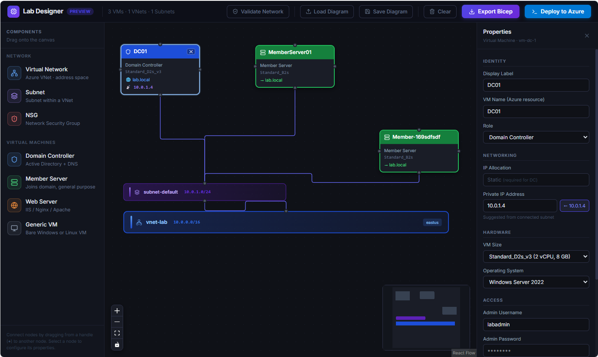

# AZDesign — Azure Visual Designer & Easy Lab Designer

> **Azure Visual Designer and easy Lab Designer** — a drag-and-drop tool to design Azure lab environments and generate production-ready Bicep templates entirely in the browser, no backend required.

[](LICENSE)
[](https://react.dev)
[](https://www.typescriptlang.org)
[](https://vitejs.dev)



---

## What is AZDesign?

**AZDesign** is a free, browser-based **Azure Visual Designer** and **easy Lab Designer** that lets you compose Azure infrastructure topologies on a drag-and-drop canvas, configure each resource through a properties panel, validate network configurations, and export Azure Bicep templates — all without writing a single line of code.

Whether you're building a quick proof-of-concept lab, teaching Azure networking, or scaffolding production infrastructure, this **visual Azure lab designer** turns a diagram into deployment-ready Bicep in seconds.

**Everything runs in the browser.** Diagrams save to portable JSON files. There is no server, no database, and no login required.

---

## Features

- 🎨 **Visual canvas** — drag-and-drop Azure components powered by React Flow
- 🏗️ **Azure resource support** — Virtual Networks, Subnets, NSGs, and four VM roles
- 🔧 **Properties panel** — per-resource configuration with live editing
- 🌐 **Intelligent IP management** — subnet-aware address suggestions, duplicate detection, DHCP vs Static toggle
- ✅ **Two-pass validation** — network topology checks + deployment readiness checks (VM naming rules, forbidden usernames, DC config)
- 📄 **Bicep export** — generates parameterised, deployment-ready `.bicep` files with embedded validation annotations
- 🔒 **AD DS domain join** — correct DSC → WaitForAD → DomainJoin dependency chain; eliminates the race condition where member servers join before the DC is ready
- 💾 **Save / Load diagrams** — portable JSON for sharing and version control
- 🚀 **Deploy wizard** — generates Azure CLI commands for one-click deployment
- 📦 **Zero backend** — fully static, deployable to GitHub Pages / Azure Static Web Apps / Vercel

---

## Quick Start

```bash
# Clone the repository
git clone https://github.com/jeevanbisht/AZDesign.git
cd AZDesign

# Install dependencies
npm install

# Start the development server
npm run dev
```

Open **http://localhost:5173** in your browser.

### Other commands

| Command | Description |
|---|---|
| `npm run dev` | Start dev server with hot module replacement |
| `npm run build` | Type-check and produce optimised production build in `dist/` |
| `npm run preview` | Serve the production build locally |

---

## Supported Azure Components

| Component | Category | Description |
|---|---|---|
| Virtual Network | Network | Top-level Azure network container with a CIDR address space |
| Subnet | Network | Sub-division of a VNet; VMs are placed here |
| NSG | Network | Network Security Group; attach to a subnet to define traffic rules |
| Domain Controller | Virtual Machine | Windows Server with AD DS and DNS; always Static IP |
| Member Server | Virtual Machine | Joins a domain; general-purpose Windows or Linux workload |
| Web Server | Virtual Machine | Runs IIS, Nginx, or Apache; configurable web stack |
| Generic VM | Virtual Machine | Bare Windows or Linux VM with no role-specific configuration |

---

## How to Use

### 1. Build your topology
Drag components from the left palette onto the canvas. Connect them by dragging from a node handle to its target:
- **VM → Subnet**
- **Subnet → VNet**
- **NSG → Subnet**

### 2. Configure resources
Click any node to open its Properties Panel and set names, IP addresses, OS versions, domain settings, etc.

### 3. Validate
Click **Validate Network** to run the built-in two-pass validator:

- **Network topology** — CIDR correctness, subnet containment, IP conflicts, Azure-reserved addresses
- **Deployment readiness** — VM naming rules (Windows 15-char limit), forbidden admin usernames, DC configuration, member server domain settings

### 4. Export Bicep
Click **Export Bicep** to generate the template. The output file includes:
- A **validation summary header** listing any detected issues
- **`@minLength` / `@maxLength` / `@secure` parameter decorators** enforced by ARM at deployment time
- **Inline `// [ERROR]` / `// [WARNING]` annotations** above any resource with issues
- Correct dependency chains for AD DS: `DSC → WaitForAD → (NIC + DomainJoin)`

### 5. Deploy
Click **Deploy to Azure** for a wizard that generates the Azure CLI commands:

```bash
az login
az group create --name <resource-group> --location <location>
az deployment group create \
  --resource-group <resource-group> \
  --template-file lab.bicep \
  --verbose
```

### 6. Save / Load
- **Save Diagram** downloads `lab-design.json` — a portable snapshot of your canvas
- **Load Diagram** restores any previously saved `.json` file

> Tip: commit `lab-design.json` alongside your Bicep templates to version-track your lab topology.

---

## Generated Bicep Example

```bicep
// ================================================================
// AZDesign — Generated Bicep Template
// Generated: 2025-01-15T10:30:00.000Z
// Repository: https://github.com/jeevanbisht/AZDesign
//
// VALIDATION: All network and deployment checks passed ✓
// ================================================================

targetScope = 'resourceGroup'

@minLength(1)
@maxLength(20)
@description('Admin username. Forbidden values: admin, administrator, root, guest, user, test.')
param adminUsername string = 'labadmin'

@secure()
@minLength(12)
@description('Admin password. Must satisfy Azure complexity requirements.')
param adminPassword string

// DC gets static IP; member NIC waits for AD to be ready before provisioning
resource nic_MemberServer01 '...' = {
  dependsOn: [ext_DC01_WaitForAD]   // ← not nic_DC01; ensures AD is running
  ...
}

// Race condition fix: poll ADWS before allowing any domain join
resource ext_DC01_WaitForAD '...' = {
  dependsOn: [ext_DC01_DSC]
  settings: {
    commandToExecute: 'powershell -Command "do { Start-Sleep 15 } until (Get-Service ADWS ...)"'
  }
}
```

---

## Project Structure

```
src/
├── store/
│   └── useLabStore.ts          # Zustand store — all nodes, edges, actions
├── types/
│   └── nodes.ts                # TypeScript interfaces for all node data types
├── components/
│   ├── Toolbar/                # Top bar — all action buttons and modals
│   ├── Palette/                # Left panel — draggable component definitions
│   ├── Canvas/                 # ReactFlow canvas — drag-drop, edge validation
│   ├── Properties/             # Right panel — per-node configuration forms
│   ├── nodes/                  # Custom node renderers
│   └── edges/                  # Custom deletable edge renderer
└── engine/
    ├── bicepGenerator.ts       # Converts canvas state → Bicep template
    └── networkValidator.ts     # Network + deployment readiness validation
```

---

## Technology Stack

| Package | Purpose |
|---|---|
| React 18 | UI framework |
| TypeScript 5.7 | Strict type safety across all components |
| Vite 6 | Dev server with HMR, production bundling |
| @xyflow/react 12 | Node/edge rendering, drag-and-drop, canvas |
| Zustand 5 | Single store for nodes, edges, selection |
| Tailwind CSS 4 | Utility classes |
| lucide-react | Consistent icon set |

---

## Deploying as a Static Site

```bash
npm run build
# Output is in dist/

# Azure Static Web Apps
az staticwebapp create --name azdesign --resource-group my-rg --source . --location eastus

# Vercel
npx vercel --prod

# GitHub Pages — add a workflow in .github/workflows/deploy.yml
```

---

## Contributing

Contributions, issues, and feature requests are welcome!

1. Fork the repository
2. Create a feature branch: `git checkout -b feature/my-feature`
3. Make your changes and ensure `npm run build` passes
4. Commit with a descriptive message
5. Push and open a Pull Request

### Extension points

- **New node type** — add interface in `types/nodes.ts`, renderer in `components/nodes/`, form in `PropertiesPanel.tsx`, and handler in `bicepGenerator.ts`
- **New validation check** — add to `validateDeploymentReadiness()` in `networkValidator.ts`; it automatically appears in both the UI modal and the exported Bicep header
- **New VM role** — add to `VMRole` union, `createDefaultVMData()`, `VMNode.tsx` role config, and the generator

---

## Documentation

Full professional documentation is available in [`AZDesign-Documentation.docx`](AZDesign-Documentation.docx) at the repository root, covering:
- Complete user guide with step-by-step instructions
- Architecture and data flow diagrams
- Developer guide for extending the application
- Deployment options and multi-user hosting considerations

---

## License

[MIT](LICENSE) — free to use, fork, and modify.
